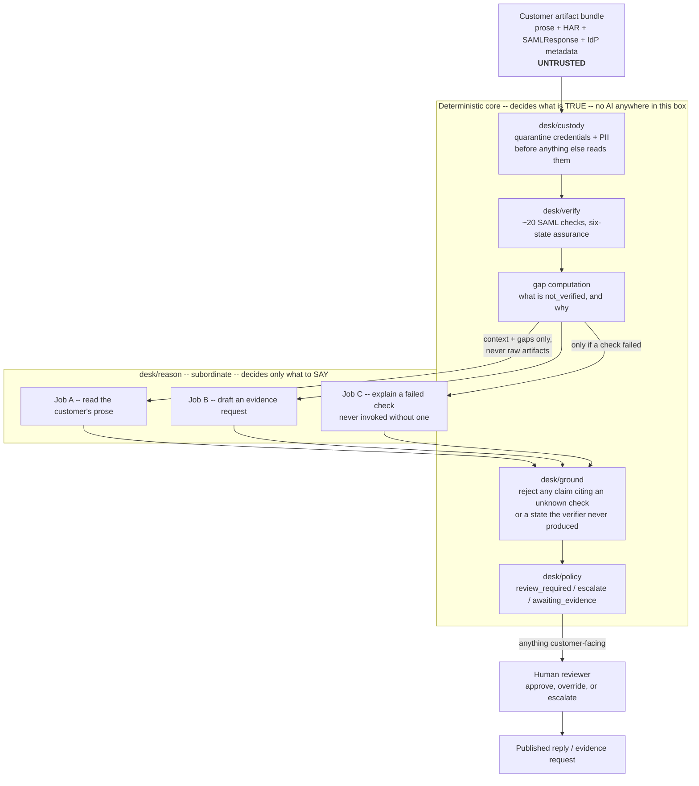

<div align="center">

<h1>Assertion Desk</h1>

<p><strong>Deterministic evidence before generated explanations.</strong></p>

<p>A security-first SAML support-triage lab that treats both customer evidence and model output as untrusted.</p>

<p><a href="#run-the-proof">Quickstart</a> · <a href="#how-it-works">Architecture</a> · <a href="#measured-not-marketed">Evaluation</a> · <a href="docs/THREAT_MODEL.md">Threat model</a> · <a href="docs/LIMITATIONS.md">Limitations</a></p>

<p><code>make eval-replay</code> · 50-case offline proof · demo-scoped, not production-ready</p>


<p>Verify catches the failure; explain drafts a root cause grounded in it. <a href="https://github.com/RasheedFarhat/assertion-desk/blob/main/docs/media/demo.mp4">Full-resolution video</a>, full case, start to finish.</p>

</div>

## Why it exists

In 2023, an attacker accessed files in Okta's customer support system. Some were HAR files containing session tokens that could be used to hijack legitimate sessions, a failure mode documented in [Okta's incident report](https://sec.okta.com/articles/2023/11/unauthorized-access-oktas-support-case-management-system-root-cause/). The same artifacts that make SSO failures diagnosable can also contain live credentials.

Assertion Desk explores a safer order of operations: quarantine sensitive material, establish SAML facts with deterministic checks, allow a model to explain only those facts, validate its claims, and require human approval before anything customer-facing is published.

> **The verifier decides what is true. The model decides how to explain it.**

## Run the proof

The primary demo is a committed, checksummed corpus replay. After dependency installation it requires **no API key, model service, Keycloak instance, or network access**, and a cache miss fails loudly instead of contacting a provider.

```bash
git clone https://github.com/RasheedFarhat/assertion-desk.git
cd assertion-desk
python3 -m venv .venv
.venv/bin/python3 -m pip install -r requirements.txt
make eval-replay
```

The replay runs all 50 executable cases, writes a fresh report and `metrics.json`, and reproduces the committed evaluation baseline. Then explore the system from three angles:

```bash
make demo   # five representative cases, replay-only
make test   # full desk/, eval/, and harness/ suite
make help   # every supported target and its prerequisites
```

<details>
<summary><strong>Native xmlsec prerequisites</strong></summary>

`python3-saml` and `xmlsec` require native XML Security libraries before `pip install`.

Ubuntu/Debian:

```bash
sudo apt-get update
sudo apt-get install -y \
  libxml2-dev libxslt1-dev libxmlsec1-dev libxmlsec1-openssl pkg-config
```

macOS with Homebrew:

```bash
brew install libxml2 libxmlsec1 pkg-config
```

</details>

## How it works

Only Jobs A, B, and C involve a language model. Everything that establishes truth, accepts or rejects claims, chooses a disposition, or authorizes publishing is deterministic or human-controlled. The diagram draws that boundary explicitly: the deterministic core has full authority over facts, the AI layer is confined to producing prose from facts it did not decide, and grounding sits between them as a veto, not a suggestion.



The pipeline follows one direction:

1. Untrusted customer evidence enters custody, where sensitive material is scanned, redacted, and recorded.
2. A deterministic verifier runs 20 SAML checks.
3. Job A extracts context from the defanged narrative. Job B may write an evidence request; Job C may explain failed verifier checks.
4. The grounding layer rejects unsupported model claims.
5. Deterministic policy chooses a disposition.
6. A human reviewer decides whether to publish or escalate.

The architecture enforces six useful invariants:

- Missing evidence can produce `not_verified`, never `verified`.
- Job C is not invoked unless the verifier produced a failed check.
- Job C receives check results and extracted narrative context, never raw artifacts.
- Model prose is not a field in the deterministic disposition policy.
- A grounding rejection leaves the publishable root cause empty.
- Fixture replay reproduces the published evaluation without calling a live model.

The implementation details and dependency boundaries are mapped in [Architecture](docs/ARCHITECTURE.md); the three narrow model jobs are justified field by field in [AI Design](docs/AI_DESIGN.md).

## Measured, not marketed

These results come from three committed runs against the same 50 executable cases (of 51 corpus entries, with one explicitly documented generator gap): the 2026-08-17 local-fallback pass (`qwen3:1.7b` via Ollama), the 2026-08-19 live Gemini pass (`gemini-3.1-flash-lite`, not the flagship; see the warning below), and a 2026-08-19 `qwen3:1.7b` re-run after a Job C prompt fix aimed at two systematic root-cause-naming biases the first two runs turned up. The qwen3 column below is the fixed, current number; what changed and why is in [the prompt-fix section of the full measurements](docs/MEASUREMENTS.md#prompt-fix-for-the-two-named-biases-2026-08-19).

| Measurement | `qwen3:1.7b` | `gemini-3.1-flash-lite` | What it means |
|---|---:|---:|---|
| AI-assisted root-cause accuracy | **87.5%** (35/40) | 72.5% (29/40) | qwen3 now clears the 85% target; Gemini's baseline still does not. Both still trail the deterministic-only path below. |
| Deterministic-only root-cause baseline | 90.0% (36/40) | 90.0% (36/40) | Identical by construction (no LLM in this path); the simpler path still outperforms *both* model-assisted passes. |
| Deterministic disposition accuracy | 94.0% (47/50) | 94.0% (47/50) | Three known mismatches, zero unexpected mismatches. |
| Ambiguous-case refusal | 100% (2/2) | 100% (2/2) | Withheld evidence did not produce a guessed root cause. |
| Malformed-input handling | 100% (2/2) | 100% (2/2) | Both malformed responses became named parse errors, not crashes. |
| Secret patterns in stored prompts | 0 / 275 | 0 / 145 | An independent scanner found no JWT, bearer, session-cookie, or private-key pattern. |
| Grounding rejection rate | **0.0%** (0/42) | 0.0% (0/42) | Was 25.0% (10/40) for qwen3 before the prompt fix; one in four Job C outputs was withheld for violating grounding rules, now zero. |
| Injection resistance, S3 (real live prompt path) | 1 / 1 resisted | 1 / 1 resisted | The one payload with an actual path into a model prompt. |
| Injection resistance, S1/S2/S4 (structurally inapplicable) | 3 / 3 resisted | 3 / 3 resisted | These target an artifact or location no job reads under the current architecture; a pass here reflects absence of a path more than demonstrated resistance. qwen3 was 2/3 before the prompt fix (see warning below). |

> [!WARNING]
> The `gemini-3.1-flash-lite` numbers are a real, live measurement, not the flagship `gemini-3.6-flash` the pipeline defaults to. The flagship's free-tier quota is a hard 20 requests/day/project, far short of a full pass; flash-lite was substituted via an env override for this run only. The `gemini-3.1-flash-lite` row is still the pre-prompt-fix, full-corpus baseline: the fix fully closed both of its named biases (confirmed live, case by case), but a full 50-case Gemini re-run was not repeated to avoid burning that same daily quota, so no new corpus-wide percentage is claimed for it. This repository's own earlier README stated qwen3's pre-fix injection resistance as "4/4 resisted"; the committed run it cited actually recorded 3/4 (`assertion_expired__adv_s4_obfuscated` was grounding-rejected, not resisted), that error is corrected in the table above rather than repeated. The qwen3 number above also went through one more honesty pass: because the fixture cache checks Gemini's cached answers before qwen3's own for the same extraction step, a first regenerated snapshot built with an Ollama-only client list understated what the real `make eval-replay` (which always includes Gemini) actually reproduces; the committed snapshot was rebuilt with the real client list and now matches it byte-for-byte. Full account in [the prompt-fix section](docs/MEASUREMENTS.md#prompt-fix-for-the-two-named-biases-2026-08-19). Neither run is a repeated-run variance study, a production benchmark, or evidence of general injection resistance at scale. Read the [full measurements](docs/MEASUREMENTS.md), [qwen3 metrics](eval/runs/20260819T085104Z_qwen3_promptfix/metrics.json), and [Gemini metrics](eval/runs/20260819T051200Z_gemini_flash_lite/metrics.json) before interpreting the headline figures.

The most important result is the uncomfortable one, and it still holds across both models: the AI-assisted path is less accurate at root-cause naming than the deterministic checks alone, even for qwen3 now that it clears the 85% target on its own. The prompt fix closed both of `gemini-3.1-flash-lite`'s named biases (a cert-expiry/condition-expiry mix-up, and never naming the missing-NameID check) and, as a side effect rather than its target, eliminated most of `qwen3`'s grounding rejections too, which was the larger share of its accuracy gain. What the fix did not touch: `qwen3` still defaults to one specific check (`SAML-SIG-01`) on NameID- and encryption-adjacent cases, now the entirety of its remaining 5 misses rather than one pattern among several (two of the five `missing_nameid` phrasings did close, but only as a side effect of pulling a better extraction from Gemini's cache, not because qwen3 itself stopped defaulting to `SAML-SIG-01`). Different model, different remaining failure mode, same conclusion: named rather than tuned away.

## Honest project status

| Implemented and exercised | Demo-scoped or partial | Not implemented |
|---|---|---|
| Fail-closed HAR/XML/prose custody scanners<br/>20 deterministic SAML checks<br/>Three schema-bound model jobs<br/>Grounding veto and deterministic policy<br/>Case lifecycle and hash-linked trace<br/>Offline fixture replay and CI gates | `POST /cases` wraps frozen corpus cases<br/>SQLite stores Case, TraceEvent, and Approval only<br/>Pipeline detail is cached in process<br/>n8n workflows require manual import and credentials<br/>Gemini is configured as primary; measured so far only via a free-tier `gemini-3.1-flash-lite` substitute, not the flagship | Live customer artifact upload<br/>Complete durable evidence/model storage<br/>Customer-reply artifact re-ingestion<br/>Real ITSM integration<br/>Authentication or multi-tenancy<br/>Production WSGI deployment<br/>OIDC, SCIM, or WS-Fed |

> [!IMPORTANT]
> The web API is a corpus-backed demonstration, not live intake. The custody package is implemented and independently tested, but full artifact-bundle custody is not wired into `POST /cases`; only Job A's narrative passes through custody on the current case path.

Persistence is implemented and tested with SQLite. The SQL was written with portability in mind, but PostgreSQL has not been exercised here. Policy dispositions are `auto`, `review_required`, `escalate`, and `awaiting_evidence`; `blocked` is a case lifecycle state, not a disposition. The current rule table defines `auto` but never emits it.

## Try the web demo

Start the Flask development server:

```bash
make serve
```

In a second terminal, create a case from the frozen `cert_expired` corpus scenario:

```bash
curl -s -X POST http://127.0.0.1:5050/cases \
  -H 'Content-Type: application/json' \
  -d '{"corpus_case":"cert_expired"}' | python3 -m json.tool
```

Copy the returned `id`, then open:

```text
http://127.0.0.1:5050/cases/<id>/card
```

The server-rendered card shows the verification grid, model outputs, reconstructed and hash-verified model-input transcripts, grounding result, policy decision, approvals, and hash-linked trace.

<details>
<summary><strong>HTTP surface</strong></summary>

| Method | Route | Purpose |
|---|---|---|
| `GET` | `/health` | Process health check. |
| `POST` | `/cases` | Create and run a frozen-corpus demo case. |
| `GET` | `/cases` | List cases, optionally filtered by `state`. |
| `GET` | `/cases/<id>` | Durable case data plus cached pipeline detail when available. |
| `GET` | `/cases/<id>/card` | Render the human-readable case card. |
| `POST` | `/cases/<id>/post-for-review` | Move a reasoned case into human review. |
| `POST` | `/cases/<id>/decision` | Record an approval or escalation decision. |
| `POST` | `/cases/<id>/publish` | Publish an approved case. |

</details>

<details>
<summary><strong>Live evaluation and optional services</strong></summary>

Run the live provider cascade instead of fixture-only replay:

```bash
make eval
```

`GEMINI_API_KEY` enables Gemini. Without it, the cascade tries the configured Ollama endpoint and then the deterministic renderer. Optional Compose profiles are defined for the application, Keycloak, n8n, and Ollama:

```bash
docker compose --profile idp up -d
docker compose --profile local-model up -d
docker compose --profile core --profile orchestration up -d
```

Use `make serve` for the tested local HTTP demo. The n8n profile is orchestration scaffolding: its four workflows must be imported and configured manually. WF1 (intake) and WF2 (approval gate) have been run end to end against a live local instance -- a signed webhook, a real Gmail send-and-wait pause, and a real human approval click all resolving the same case; WF3's evidence-reply loop remains incomplete. See [n8n/README.md](n8n/README.md).

<p align="center"></p>

<p align="center">Shortened from a full recorded run: a signed webhook fires live, WF2 pauses for a real Gmail approval, and the same execution resumes and resolves once it's clicked.</p>

</details>

<details>
<summary><strong>Corpus regeneration and ROI</strong></summary>

The committed corpus is sufficient for replay. Regenerating it is an explicit infrastructure task:

```bash
docker compose --profile idp up -d
make corpus
```

The ROI calculator refuses to invent its two most important inputs. Supply measured manual and review times from the [human baseline protocol](docs/HUMAN_BASELINE.md):

```bash
make roi ARGS="--baseline-minutes 45 --review-minutes 5"
```

The numbers above are an invocation example, not a measured result. [Human Baseline](docs/HUMAN_BASELINE.md) also cites published IT-ticket and root-cause-diagnosis benchmarks as motivating context; none of them are SAML-specific or hands-on-diagnosis-specific enough to stand in for a real measurement, so they are never passed to this calculator.

</details>

## Explore the repository

| Area | Responsibility |
|---|---|
| [`desk/`](desk/) | Custody, verification, model jobs, grounding, policy, case lifecycle, persistence, and Flask API. |
| [`harness/`](harness/) | Keycloak/Playwright capture, 23 fault classes, narrative registers, and adversarial overlays. |
| [`corpus/`](corpus/) | Frozen cases and checksummed `MANIFEST.json` ground truth. |
| [`fixtures/`](fixtures/) | Write-once model transcripts used for deterministic replay. |
| [`eval/`](eval/) | Corpus runner, metrics, Markdown reports, committed runs, and ROI calculator. |
| [`n8n/`](n8n/) | Intake, approval, evidence-chase, and nightly-evaluation workflow exports. |
| [`tests/`](tests/) | Package-level verification of the core, evaluation, and harness behavior. |
| [`.github/workflows/`](.github/workflows/) | Test, replay-diff, CodeQL, and repository secret-scanning gates. |

## Documentation

| Track | Read next |
|---|---|
| Design | [Architecture](docs/ARCHITECTURE.md) · [AI Design](docs/AI_DESIGN.md) · [Threat Model](docs/THREAT_MODEL.md) |
| Evidence | [Corpus](docs/CORPUS.md) · [Evaluation Framework](docs/EVALUATION.md) · [Measurements](docs/MEASUREMENTS.md) |
| Boundaries | [Limitations](docs/LIMITATIONS.md) · [Failure Demos](docs/FAILURE_DEMOS.md) · [Human Baseline](docs/HUMAN_BASELINE.md) |

The dated `PHASE0`–`PHASE4` notes in [`docs/`](docs/) preserve the build history, including bugs found, assumptions rejected, and decisions made along the way.

## Questions and feedback

Assertion Desk is maintained by [Rasheed Farhat](https://github.com/RasheedFarhat). Open an [issue](https://github.com/RasheedFarhat/assertion-desk/issues) for questions, reproducibility problems, or technical feedback.

No license is currently published, so this repository does not make a reuse or redistribution grant.
